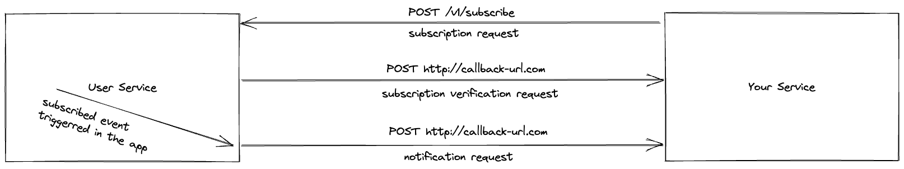

# faceit-backend-test
## Introduction
This is a microservice that manages user operations.

### Tech Stack
Golang, Docker, Postgresql

### Allowed Endpoints and Methods

**You can try and check endpoints from swagger link in detail after running the app in your local:**
[Swagger](http://localhost:8080/swagger/index.html)

| Endpoint       | Method |
|----------------|--------|
| /v1/health     | POST   |
| /v1/subscribe  | POST   |
| /v1/users      | GET    |
| /v1/users      | POST   |
| /v1/users/{id} | DELETE |
| /v1/users/{id} | PATCH  |

## Design Choices

### API
API has 3 controllers which are subscribe, health and users. 
I've created a package for each controller because I think that it is more go way of organizing a Golang application.
In Go, we organize code by their functional responsibilities.

### Notifications

The user service has ability to notify other services about any event. 
#### Flow description
To be able to receive notifications for events, you need to call subscribe endpoint, in its request body you are going to need to 
provide a callback url and a topic name. The topic name is the topic of the event you'd like to subscribe. 
The callback url is the endpoint that you should be serving to be able to receive the notification for that specific topic. After calling subscribe endpoint, the app sends the request to the verification queue. While processing the request in the verification queue, the callback endpoint that you've provided in the request is called with a request body.



**Allowed Topics**: `user.update`

Verification Payload:

```http
  POST http://example-callback-url.com/endpoint
```
#### Headers
| Parameter                      | Type     | Description                                                                                                                                                               |
|:-------------------------------|:---------|:--------------------------------------------------------------------------------------------------------------------------------------------------------------------------|
| `Notification-Message-Type`    | `string` | the value of this header will be webhook_callback_verification for verification flow. <br/>In that way, you can distinguish a verification request from notification requests. |


#### Body: 
| Parameter    | Type         | Description                                                             |
|:-------------|:-------------|:------------------------------------------------------------------------|
| `id`         | `string`     | Subscriber id assigned by the app                                       |
| `challenge`  | `string`     | A string that generated by the app to be used in the verification flow. |
| `callback`   | `string`     | the callback url provided in subscribe request                          |
| `created_at` | `timestsamp` | the subscription timestamp                                              |

**Example verification request body**:

```json
{
  "id": "59484bbe-872d-45db-9133-592b21c781e2",
  "challenge": "8e4924b6-2cfa-11ed-a261-0242ac120002",
  "callback": "http://example-callback.com/endpoint",
  "created_at": "2022-09-03T04:45:19.064345+03:00"
}
```

**Example response that you should be sending to the request above**:
```text
8e4924b6-2cfa-11ed-a261-0242ac120002
```

If you receive this request, you should respond it with the challenge string as a plain text in the response body and 200 HTTP status code. If you don't, the subscription is not going to be verified, so you won't be able to receive the notifications for that topic.

After subscribing to a topic successfully, you are going to receive a notification when an event is triggerred. A request is made to the callback endpoint.

Notification Payload:

```http
  POST http://example-callback-url.com/endpoint
```
#### Headers
| Parameter                      | Type        | Description                                                       |
|:-------------------------------|:------------|:------------------------------------------------------------------|
| `Notification-Message-Type`    | `string`    | the value of this header will be notification.                    |
| `Notification-Message-Id`    | `string`    | a uuid generated by the service                                   |
| `Notification-Message-Timestamp`    | `timestamp` | the timestamp when the notification is sent in RFC3339Nano format |
| `Notification-Message-Signature`    | `string`    | an HMAC signature created by the service                          |

Before diving into the notification, you should verify that the sender is this app.
If you don't provide a secret while subscribing you are not going to have this feature. If you did, an HMAC-SHA256 signature is created by using the secret. 
The service passes the HMAC signature to the callback in the Notification-Message-Signature header.

To verify the signature:
1. You should create an HMAC signature using the secret and concatenating the values in the Notification-Message-Id header, Notification-Message-Timestamp header and the raw request body.
2. Compare the signatures, if they don't match you can simply ignore this notification.

#### Body:
| Parameter    | Type        | Description                                |
|:-------------|:------------|:-------------------------------------------|
| `data`       | `object`    | the notification payload data              |
| `created_at` | `timestamp` | the timestamp when the event is triggerred |

After verifying the signature, you can process the event, and then you should respond with an empty body and 200 HTTP status code.

**Example notification request body**:

```json
{
  "data": {
    "id": "e76ede05-7405-49bc-a092-8cb76294df47",
    "first_name": "Ferit",
    "last_name": "Karakaya",
    "nickname": "ferit.karakaya",
    "password": "ferit123",
    "country": "TR",
    "created_at": "2022-09-04T19:25:45.951199Z",
    "updated_at": "2022-09-04T19:25:45.951199Z"
  },
  "created_at": "2022-09-04T22:25:47.392987"
}
```


## Configuration

The configuration is performed via environment variables. If you want to run the app properly, you should set these environment variables correctly. The docker-compose uses .env file for environment variable configuration.

| Variable                        | Description                                                                                           |
|---------------------------------|-------------------------------------------------------------------------------------------------------|
| `SERVICE_NAME`                  | Name of the service                                                                                   |
| `SERVER_HTTP_ADDRESS`           | The address you'd like the app to serve from                                                          |
| `GIN_MODE`                      | DEBUG, TEST or RELEASE                                                                                |
| `POSTGRES_USER`                 | Database username                                                                                     |
| `POSTGRES_PASSWORD`             | Database user password                                                                                |
| `POSTGRES_DB`                   | Database name                                                                                         |
| `POSTGRES_HOST`                 | Database host address                                                                                 |
| `POSTGRES_PASSWORD`             | Database user password                                                                                |
| `POSTGRES_RECONNECT_TIMEOUT`    | If the app cannot connect to the database, it waits this timeout value in seconds before reconnecting |
| `POSTGRES_MAX_RECONNECT_TRIALS` | Maximum trial count for reconnection to the database                                                  |
| `POSTGRES_MAX_IDLE_CONNECTIONS` | How many idle connections can exist at maximum in the pool                                            |
| `POSTGRES_MAX_OPEN_CONNECTIONS` | How many open connections can exist at maximum in the pool                                            |
| `LOG_LEVEL`                     | Log level                                                                                             |

## Run Locally

Clone the project

```bash
git clone https://github.com/skarakasoglu/faceit-backend-test.git
```

Go to the project directory

```bash
cd faceit-backend-test
```

Run the app using docker-compose

```bash
docker-compose up --build
```

or

```bash
docker-compose up
```

**Note**: When you create the database container first time, it will take more time than the creating service container. 
It causes the app to run before database container, because Docker doesn't know about health status of a container, it only runs them in dependency order.
Since the app runs before the database container, it will log an error about not being able to connect to db server, 
but it also will try to reconnect after the timeout which is determined in POSTGRES_RECONNECT_TIMEOUT variable.

**Another Note**: 1000 rows are provided to the container in the initialization script. Therefore, the DB is going to have initially 1000 rows inserted after running.

## Running Tests

You can run tests in two ways. One of them is using make and the other one is using docker.

### Make

The below command runs your tests on the local:

```bash
make test
```

If you'd like to see the coverage in detail. You can run the make command below. It will create an output file named cover.html on the current directory. You can check the code coverages in an UI way.

```bash
make coverage
```

### Docker

You can also run tests on a docker container by using the command below.

```bash
docker build -t faceit-backend-tests:1.0.0 -f Dockerfile.test .
docker run --name FaceitBackendTests faceit-backend-tests:1.0.0
```

You can also use docker-compose for running tests.

```bash
docker-compose -f docker-compose-test.yml -p faceit-backend-tests up
```

## Possible Improvements
- [ ] Creating a retry queue mechanism in case of errors for notifications
- [ ] We cannot say that the app is scalable at all, because the subscribers are handled in the memory of the app. To scale the app, an in memory database like Redis might be used to store the subscribers of topics.

## Documentation

[Swagger](http://localhost:8080/swagger/index.html)
